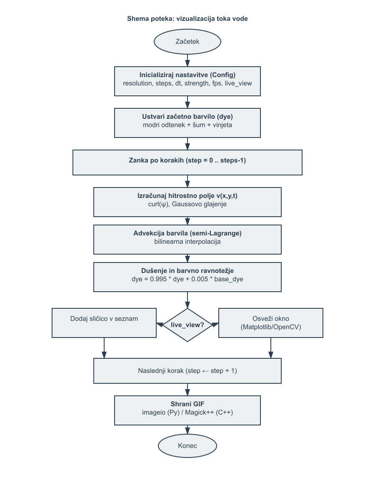

# Water Flow Visualization (Python & C++)



Interactive and offline visualization of a divergence‑free water/ink flow field in both Python and C++. The effect comes from a time‑varying stream function, a derived velocity field, semi‑Lagrangian advection of a dye buffer, mild diffusion/damping, and optional live preview and GIF export.

## Highlights
- Divergence‑free velocity via stream function curl (smooth, vortexy motion)
- Semi‑Lagrangian advection (stable transport with bilinear sampling)
- Configurable resolution, steps, time step, strength, and FPS
- Python: quick to run and tweak; C++: faster runtime and optional live view
- GIF export for sharing results

## Repository Structure
- `water_flow_visualization.py` – Python implementation with CLI options
- `water_flow_visualization.cpp` – C++ implementation (CMake project)
- `docs/` – Report (`report.tex` → `report.pdf`), build scripts, and flowchart image
  - `docs/build_pdf.ps1`, `docs/build_pdf.bat` – simple LaTeX build helpers
  - `docs/build_pdf.py` – Python builder (latexmk/pdflatex; optional PATH helpers)
  - `docs/report_from_python.py` – pure‑Python PDF (Matplotlib) alternative

## Quick Start (Python)
Prerequisites: Python 3.9+, `pip`

```
pip install -r requirements.txt
python water_flow_visualization.py --fps=60 --strength=1.0 --no-live-view
```

Options (examples):
- `--resolution=512` – image size (higher is slower)
- `--steps=300` – number of frames
- `--dt=0.8` – advection time step
- `--strength=1.2` – velocity scale (more pronounced vortices)
- `--gif-name=water_flow.gif` – output GIF filename

The script can show a live preview window (if supported) and saves an animated GIF in `output_frames/` by default.

## Quick Start (C++)
Prerequisites: CMake, a C++17 compiler. For GIF export, ImageMagick (Magick++). For live view, OpenCV (optional).

```
cmake -S . -B build -DWATER_FLOW_USE_OPENCV=ON ^
  -DOpenCV_DIR="C:\\Path\\to\\opencv" ^
  -DImageMagick_INCLUDE_DIRS="C:\\Program Files\\ImageMagick-7.X\\include" ^
  -DImageMagick_LIBRARIES="C:\\Program Files\\ImageMagick-7.X\\lib\\CORE_RL_Magick++_.lib; \
    C:\\Program Files\\ImageMagick-7.X\\lib\\CORE_RL_MagickCore_.lib; \
    C:\\Program Files\\ImageMagick-7.X\\lib\\CORE_RL_MagickWand_.lib"
cmake --build build --config Release
```

Run: `build\\Release\\water_flow_cpp.exe --fps=90 --no-live-view`

## Documentation
- Report sources: `docs/report.tex` → PDF in `docs/report.pdf`
- Build (CMD/PowerShell): run `docs/build_pdf.bat` or `docs/build_pdf.ps1`
- Build (Python wrapper): `python docs/build_pdf.py`
  - Auto‑detects `latexmk` or falls back to `pdflatex`×2
  - Flags `--texbin` and `--inkscape-bin` can add tool paths just for this run

Note: The report now includes the flowchart as a PNG (`docs/flowchart.png`), so `-shell-escape` and Inkscape are not required for LaTeX builds.

## Troubleshooting
- “pdflatex not found”: add TeX bin to PATH or use `docs/build_pdf.py --texbin "C:\\Program Files\\MiKTeX\\miktex\\bin\\x64"`
- VS Code vs CMD PATH differences: fully restart VS Code or ensure the terminal inherits PATH and uses the desired shell.

## Credits
- Flow visualization idea inspired by classic stable fluid/advection techniques adapted for simple 2D dye transport.
